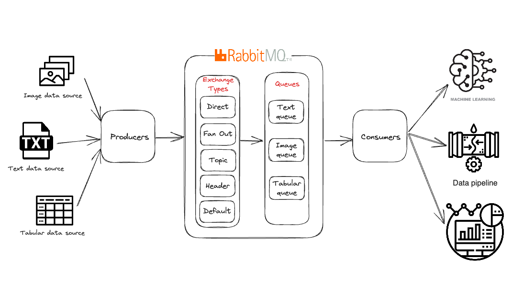
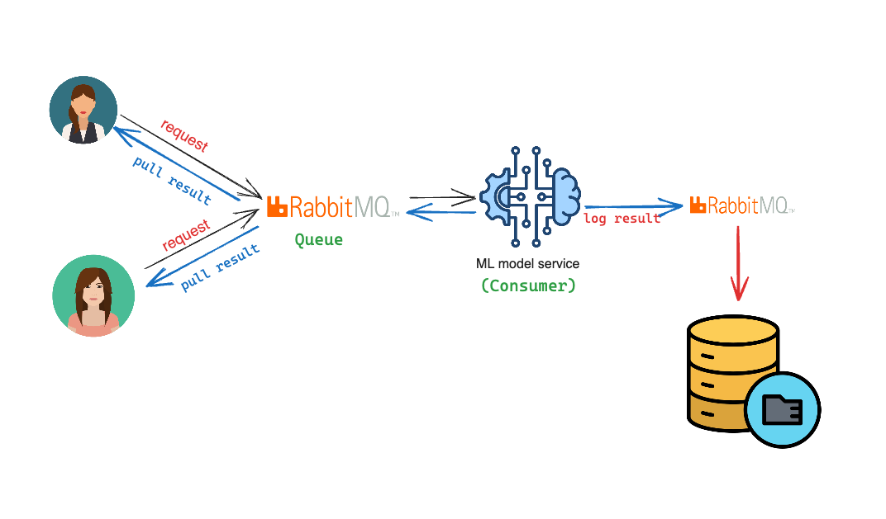

# Default of Credit Card Clients Dataset

This project demonstrates a real-time machine learning pipeline using RabbitMQ for message queuing and Docker for containerization. It implements a credit card default prediction system that processes tabular data through a producer-consumer architecture, enabling scalable and asynchronous model inference workflows.

## Project Structure

```txt
/rabbitMQ
├── docker-compose.yml       # Docker Compose file to set up RabbitMQ and producer services
├── requirements.txt 
├── k7-ml-presentation.pdf  
├── README.md
├── UCI_Credit_Card.csv
├── save_model.py  
├── k7_ml.ipynb     
├── producer
│   ├── Dockerfile           # Dockerfile to build the producer image (for tabular data only)
│   ├── credit_card_demo.csv             # Sample data file for the `tabular` producer
│   ├── stream_tabular_ingestion.py          # Script to produce messages to RabbitMQ
│   └── images               # Directory containing sample images
│       ├── image1.jpeg
│       ├── image2.jpeg
│       └── ...
└── consumer
    └── tabular_consumer.py     # Script to consume text data from RabbitMQ
```

## Architecture


## Common Use Cases in ML

### Real-time Model Serving Architecture

Real-time ML serving architecture where multiple clients can request predictions simultaneously while maintaining high throughput and low latency.



- Clients: Multiple users/systems sending prediction requests
- Request Queue: Manages incoming prediction requests
- ML Model Service: Consumes requests and generates predictions
- Results Queue: Stores predictions for client retrieval
- Results Database: Persistent storage for prediction history

### Model Pipeline Orchestration

```txt
[Raw Data] → RabbitMQ → [Preprocessing] → RabbitMQ → [Feature Engineering] → RabbitMQ → [Model Inference]
```

## Setup and Run

### Running the Producer and Consumer within Docker Containers

#### Step 1: Build and Start the Services


Build and start the services using Docker Compose:

   ```shell
   docker compose -f docker-compose.yaml up -d
   ```

   This command will build the Docker images and start the RabbitMQ and producer services.

#### Step 2: Verify RabbitMQ

Access the RabbitMQ management UI to verify that RabbitMQ is running. Open your browser and go to:

   ```txt
   http://localhost:15672
   ```

   The default username and password are both `guest`.

#### Step 3: Run the Consumers

##### Run the CSV Consumer

1. Open a new terminal window.

2. Run the consumer script to start consuming messages from the RabbitMQ queue:

   ```shell
   python consumer/tabular_consumer.py --rabbitmq_server localhost --queue_name alicpp_records
   ```

   This script will start consuming messages from the specified RabbitMQ queue and print them to the console.

### Running the Producer Scripts Locally

#### Prerequisites

- Ensure RabbitMQ is running locally. You can start RabbitMQ using Docker (skip it if you have already run `docker-compose`):

  ```shell
  docker run -d --name rabbitmq -p 5672:5672 -p 15672:15672 rabbitmq:3-management
  ```

- Install the necessary Python packages:

  ```shell
  pip install -r requirements.txt
  ```

#### Run the Tabular Data Producer

1. Navigate to the `producer` directory.

2. Run the tabular data producer script:

   ```shell
   python stream_tabular_ingestion.py --mode setup --rabbitmq_server localhost
   ```
## Notes

- The producer services will automatically start sending messages to the RabbitMQ queue once the services are up and running.
- The consumer scripts need to be run manually in separate terminal windows.

## Troubleshooting

- If you encounter any issues with the RabbitMQ connection, ensure that the RabbitMQ server is running and accessible.
- Check the logs of the Docker containers for any error messages:

  ```shell
  docker logs <container_name>
  ```
